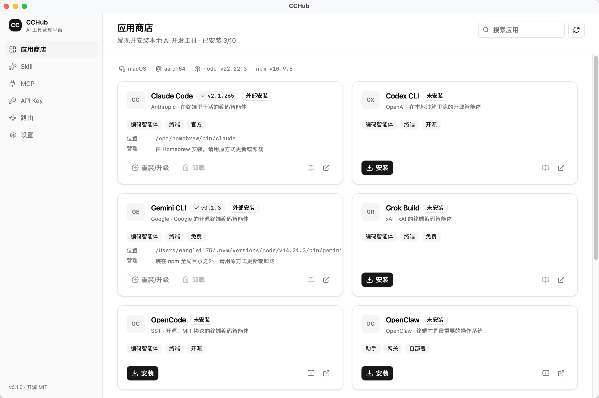

# CCHub

**English** | [简体中文](README.zh-CN.md)

An open-source, cross-platform AI desktop app store — also a local AI tool management platform. One window to manage the AI development tools scattered across your terminal: discover, install, update, configure.

Supports macOS and Windows.



## Current Status

The home page (app store) is usable; the remaining modules are placeholder pages on the roadmap — see [docs/ROADMAP.md](docs/ROADMAP.md).

| Module | Status | Notes |
| --- | --- | --- |
| App Store | ✅ Ready | Detect / install / update / uninstall 7 npm CLIs; detect 3 external apps |
| Infrastructure | ✅ Ready | Preference store (versioned + atomic writes), remote catalog source (allowlist filtering + cache fallback), proxy injection (M0) |
| Settings | ✅ Ready | Theme / language / launch at login / startup behavior / proxy (with connectivity test) / catalog source / environment diagnostics (M1) |
| Skill Management | ✅ Ready | 30 whitelisted Skill install sources (the full official anthropics/skills set + community obra/superpowers), enable/disable (`.disabled`), uninstall (path-escape safe) (M2) |
| API Key | ✅ Ready | System keychain storage (keyring), connectivity test, masked display (M4) |
| Routing | ✅ Ready | Multiple managed provider presets + one-click switch and push-down; hosts: Claude Code (settings.json env + model tier mapping) + Codex (config.toml `model_providers` + auth.json) + Gemini CLI (~/.gemini/.env); 9 provider catalog entries; reads back the host's actual config and flags drift (M5+) |
| MCP | ✅ Ready | 9 service catalog entries (official + Filesystem / Playwright / Context7 / Desktop Commander / Firecrawl), parameter and env forms (`@keychain:` references), writes to three hosts (Claude Code / Codex / Gemini CLI, with backup and removal of only its own entries), handshake test (M3+) |

### What the home page can do

- Detect whether catalog apps are installed locally, showing version and executable path
- Query npm registry for the latest version, offering an update entry point when one exists
- One-click install / update / uninstall (uninstall asks for confirmation), with npm output streamed into the card
- Translate common npm failures (`EACCES`, network timeouts, `E404`) into actionable hints
- Disable installation and guide the user to set up Node.js first when it is missing
- Detect whether an install is npm-managed: Homebrew / official-script installs get no npm actions, avoiding a second copy

## Tech Stack

| Layer | Choice |
| --- | --- |
| Shell | Tauri 2 |
| Backend | Rust 2021 |
| Frontend | React 19 + TypeScript 7 + Vite 8 |
| Styling | Tailwind CSS 4 + shadcn/ui (default neutral theme, no branding changes) |
| State | Zustand 5 |
| Routing | React Router 7 (hash mode) |

## Requirements

For development:

- Node.js 20+ (this project is developed on 24) and pnpm 10+
- Rust 1.87+ (install via `rustup`; Tauri 2's current dependency tree needs edition2024, older versions fail to compile)
- Platform dependencies:
  - macOS: Xcode Command Line Tools (`xcode-select --install`)
  - Windows: Microsoft C++ Build Tools + WebView2 runtime (bundled on Win11)

To run: macOS 12+ / Windows 10+.

## Quick Start

```bash
pnpm install
pnpm tauri:dev      # launch the desktop app (first run compiles Rust, takes a few minutes)
```

When you only need to work on the UI, you can run without the Tauri shell — IPC then uses built-in mock data:

```bash
pnpm dev            # http://localhost:1420
```

Build:

```bash
pnpm tauri:build    # output in src-tauri/target/release/bundle/
```

## Project Structure

```
├── src/                      Frontend
│   ├── components/
│   │   ├── ui/               shadcn/ui primitives (official variants only, no custom colors)
│   │   ├── layout/           Sidebar and page header
│   │   ├── AppCard.tsx       App card (status + actions + logs)
│   │   └── ...
│   ├── pages/                Five top-level pages
│   ├── store/apps.ts         Zustand store, aggregates detection and task state
│   ├── lib/
│   │   ├── ipc.ts            The single channel to Rust (with browser mock)
│   │   └── catalog.ts        Display metadata for the app catalog
│   └── types/                Types mirroring the Rust structs
├── src-tauri/                Rust side
│   └── src/
│       ├── registry.rs       Allowlist of installable apps
│       ├── apps.rs           Detect / install / uninstall commands
│       └── sys.rs            PATH resolution, subprocess construction, version comparison
└── scripts/generate-icon.mjs Zero-dependency app icon generation
```

### Two design points

**The package allowlist lives on the Rust side.** The frontend can only request operations by `id` (e.g. `claude-code`); the actual npm package name is looked up in `src-tauri/src/registry.rs`. The frontend cannot splice an arbitrary string into `npm install`, so command injection is structurally impossible.

**PATH must be harvested from the login shell.** On macOS, an `.app` launched from Finder / Dock inherits a `PATH` that usually contains only `/usr/bin:/bin:/usr/sbin:/sbin` — node installed via nvm / homebrew / volta is not in it. `sys.rs` resolves the user's real `PATH` with `$SHELL -ilc` and caches it; otherwise you get "it's clearly installed but not detected". The Settings page's "Environment Diagnostics" shows the resolved result to make troubleshooting easier.

## Adding a New App

1. Add an entry to `APPS` in `src-tauri/src/registry.rs`, specifying the npm package name and executable name
2. Add a display metadata entry with the same `id` to `CATALOG` in `src/lib/catalog.ts`
3. Add the id to `AppId` in `src/types/index.ts`

## Tests

```bash
pnpm build                          # type check + frontend build
cd src-tauri && cargo test          # Rust unit tests (version parsing, allowlist)
```

## License

MIT
